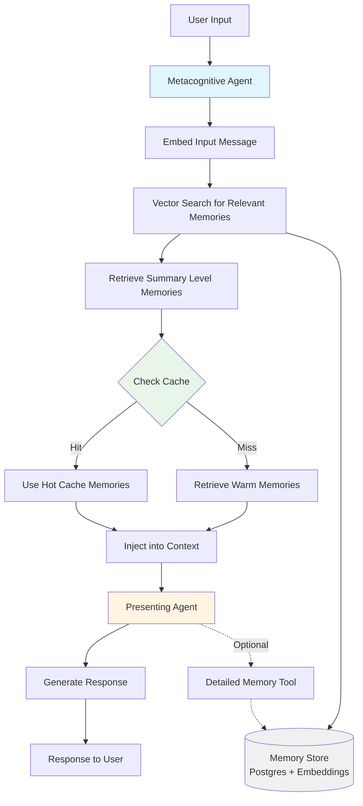

# Memory Management Architecture

## Overview
This document outlines the design decisions for the memory management system in the NetNavi-inspired companion agent project. The system is designed to provide both short-term conversational context and long-term persistent memory with intelligent retrieval mechanisms.

---

## Core Architecture

### Short-Term Memory
- **Implementation**: Conversation context window
- **Scope**: Current conversation session
- **Purpose**: Maintains immediate conversational context and recent interactions

### Long-Term Memory (Two-Tier System)

#### 1. Summary Level
- **Retrieval**: Automatic via embedding-based similarity search
- **Trigger**: Based on user input message (or agent self-prompts)
- **Injection**: Loaded into context before agent response
- **Purpose**: Provides high-level context relevant to current topic

#### 2. Detailed Level
- **Retrieval**: On-demand via tool call by the presenting agent
- **Trigger**: Agent explicitly requests more information
- **Access**: Direct query to memory store
- **Purpose**: Deep dive into specific memories when summary isn't sufficient

---

## Storage Implementation

### Database
- **Technology**: PostgreSQL (or similar relational database)
- **Embedding Model**: For vector similarity search
- **Retrieval Method**: Cosine distance/similarity for finding relevant memories

### Memory Significance Scoring
Memories are weighted based on:
- **Recall Frequency**: How often the memory is accessed
- **Impact/Survival Value**: Importance for goal accomplishment or "survival" (using survivalistic terms as a heuristic)
- **Lifecycle**: Low-significance memories are eventually compressed or discarded

---

## Caching Strategy (Hot/Warm/Cold)

### Hot Cache (Always in Context)
- **Size**: 5-10 most frequently accessed memories
- **Update Frequency**: Periodic refresh based on access patterns
- **Purpose**: Acts as "working memory" - always available without retrieval delay
- **Analogy**: Information you think about so often it's always at hand

### Warm Cache (Per-Message Retrieval)
- **Size**: 3-5 relevant summary memories per input
- **Selection**: Based on embedding similarity to current input
- **Purpose**: Contextually relevant memories for this specific interaction
- **Latency**: ~200-500ms retrieval time

### Cold Storage (Tool-Based)
- **Access**: Via explicit tool call from presenting agent
- **Content**: Detailed memory information
- **Purpose**: Deep context when summaries aren't sufficient
- **Latency**: Variable, but acceptable for deliberate lookups

---

## Agent Architecture

### Metacognitive Agent
- **Role**: Memory orchestration and retrieval
- **Responsibilities**:
  - Embeds incoming user messages
  - Performs vector search for relevant memories
  - Manages hot/warm cache
  - Injects summary-level memories into presenting agent's context
- **Tools**: Direct access to memory store for retrieval operations

### Presenting Agent (Conversational Agent)
- **Role**: User-facing conversation and response generation
- **Memory Access**:
  - Receives summary memories automatically in context
  - Can optionally call detailed memory tool for deeper information
- **Direct Access**: Can query memory store directly without going through metacognitive agent

---

## Memory Retrieval Flow

---

## Performance Considerations

### Latency Optimization
- **Target**: Sub-second memory retrieval for typical interactions
- **Strategy**:
  - Input-based retrieval only (no extended thinking pass for MVP)
  - Fast embedding + vector search (~200-500ms)
  - Hot cache eliminates retrieval for frequent concepts
  - Parallel processing where possible

### Scalability
- **Embeddings**: Indexed for fast similarity search
- **Database**: Optimized for vector operations
- **Caching**: Reduces database load for common queries

---

## Separate Systems

### Intentions/Reminders Table
- **Purpose**: Stores future follow-ups and agent self-scheduled tasks
- **Scope**: Distinct from general memory storage
- **Contents**:
  - Scheduled check-ins (time-based)
  - Self-set reminders
  - Follow-up intentions with priority/significance scores

---

## Design Decisions Summary

### ✅ Decisions

1. **Two-tier memory**: Summary (automatic) + Detailed (on-demand)
2. **Input-based retrieval**: Only based on user message, not extended thinking (for latency)
3. **Three-level cache**: Hot (always), Warm (per-message), Cold (tool-based)
4. **Embedding-based search**: For both summary and detailed levels
5. **PostgreSQL + embeddings**: For persistent storage
6. **Significance scoring**: Based on recall frequency + survival/accomplishment value
7. **Direct tool access**: Presenting agent can query detailed memories without metacognitive mediation
8. **Separate intentions system**: Reminders/follow-ups stored independently from memories

### 🔄 To Be Decided Later

1. **Memory creation mechanism**: Automatic extraction, tool call, or both?
2. **Compression strategy**: How to condense low-significance memories vs. when to discard?
3. **Follow-up delivery timing**: Staleness thresholds, push notification frequency, timing optimization
4. **Cache update frequency**: How often to refresh hot cache based on access patterns?

---

## Future Enhancements

### Phase 1 (MVP)
- Input-based summary memory injection
- Basic hot/warm/cold cache
- Simple detailed memory tool
- PostgreSQL with embedding storage

### Phase 2 (Optimization)
- Context-aware delivery timing for follow-ups
- Advanced memory compression algorithms
- Predictive memory loading based on conversation patterns
- Memory significance auto-adjustment based on usage

### Phase 3 (Advanced)
- Cross-session memory patterns
- Automatic memory consolidation during idle periods
- Emotional significance markers
- Multi-modal memory (text, voice, context)

---

*Document Created: 2026-01-31*
*Project: NetNavi-Inspired Companion Agent (Project EXE)*